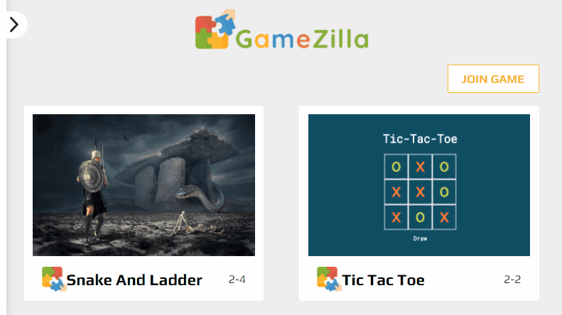
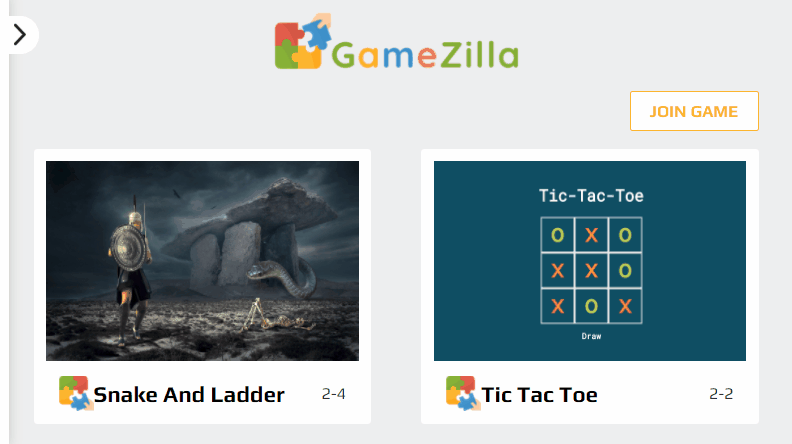
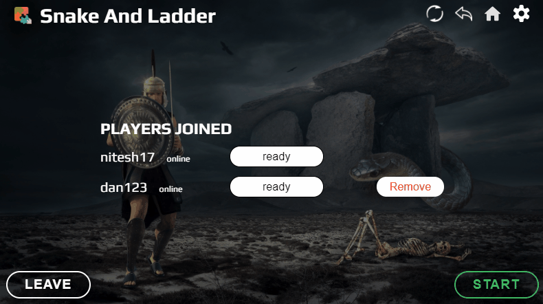
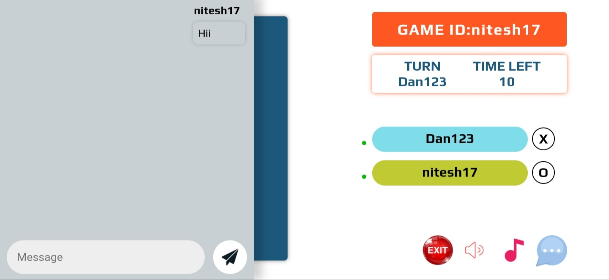
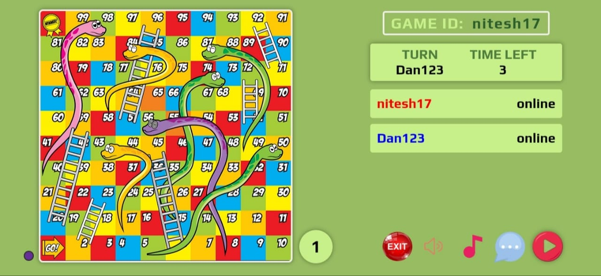
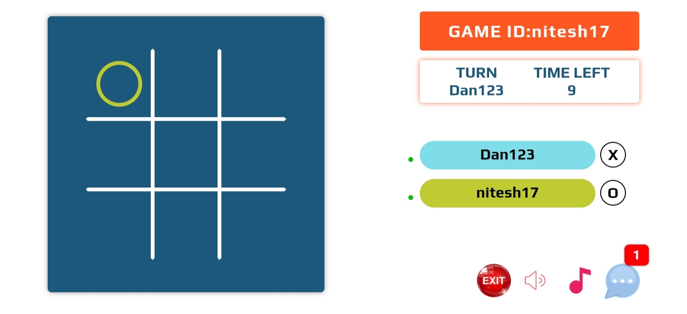

## About GameZilla

**GameZilla** is an online mutiplayer gaming platform through which users can
create their own room or join others room to play game together.

---

<!-- Live at [gamezilla.fun](https://gamezilla.fun) -->

---

## Available Features

- Can create maximum of three rooms at a time
- Can join any number of room.
- Share link with friends to join your room. 
- Can also share **Game Id** with friends.
- Player can leave room/game at any time.
- No need to join game always from link or Game Id. Shortcut is automatically
  created at Home page to join room/game. You can also leave any game through
  the shortcut also. 
- Host can remove any player from room before starting the game.
- Host can start game only when all members of the room are **ready**.
- Host can change the game inside the room. 
- Players can chat between the game. 

---

## Available Games

### Snake And Ladder



### Tic Tac Toe



---

## Installing for development

You will need to install Redis to run this project. Please install it from
[here](https://redis.io/download)

Install your forked repo:

```shell
    git clone git://github.com/<your_fork>/GameZilla
    cd GameZilla/
```

Install requirements.txt:

```shell
    pip install requirements.txt
```

Create Database:

```shell
    ./manage.py migrate
    ./manage.py createsuperuser
    ./manage.py create_games
```

Launch the Redis server

Launch the development server:

```shell
    ./manage.py runserver
```

**Note:** Please read contribution guidlines to make a great impact on the
project.

---

## Contribution Guidelines

Any One willing to contribute in this project and wants their games to be hosted
on the gamezilla platform are welcomed.

**_Please follow below points before creating any PR._**
- Add upstream and always create new branch from ``upstream/development`` not from ``upstream/master``.
- Run `./gamezilla-qa-format` after making all changes.
- Format your JavaScript and CSS files with `prettier`.
- Run `./run-checks`. Fixed errors shown in the terminal if any.
- PRs should be generated against development.

# Thanks For Your Contribution
